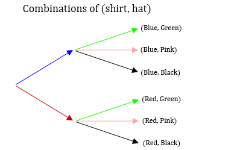

# Counting

## Size of a set
The set $A = \{5,6\}$ has two elements. There is a notation to say the size of a set:
$$n(A) = 2$$ 
$n$ is a function that takes in a set and outputs the number of elements in it: 
$$n: Sets \to Whole \ Numbers$$
Let the sample space be $S = \{1,2,3,4,5,6\}$. Since $A=\{5,6\}$, $A^C= \{1,2,3,4\}$ and $n(A^C)=4$. There is a formula we can use for the size of the complement: $$n(A^C) = n(S) - n(A)=6-2=4$$ 
This is saying the size of the complement of a set is the size of the sample set minus the size of the set. I think this is pretty intuitive.

## Principle of Inclusion-Exclusion
We define sets $A$ and $B$: 
$$A = \{3,4,5\} \quad \quad B = \{4,5,6\}$$ 
We can see that $A \cup B = \{3,4,5,6\}$ and $n(A \cup B) = 4$. 
Notice that $n(A \cup B) \not = n(A) + n(B)$. 

There is a special formula for the number of elements in a union called the principle of inclusion-exclusion.
$$n(A \cup B) = n(A) + n(B) - n(A \cap B)$$
We subtract $n(A \cap B)$ from this expression because the elements of the intersection are counted twice -  once in $n(A)$, and once in $n(B)$. Using the sets from earlier, $A \cap B = \{4,5\}$. We can verify that the formula works by calculating $$n(A \cup B) = n(A) + n(B) - n(A \cap B) = 3 + 3 - 2 = 4$$

If the intersection of two sets is the empty set then the size of the union is the sum of the size of the sets.
$$A \cap B = \emptyset \iff n(A \cap B) = 0 \iff n(A \cup B) = n(A)+n(B)-0 = n(A)+n(B)$$
When two sets have no elements in common we call them **mutually exclusive**.

There is also a formula for the size of the union of three sets.
$$n(A \cup B \cup C) = n(A) + n(B) + n(C) - n(A \cap B)-n(B \cap C)-n(C \cap A) + n(A \cap B \cap C)$$
Consider how many times elements from each of the sections of a venn diagram with three sets are counted using the above formula. You should conclude that each element in $A \cup B \cup C$ is counted exactly once.

## Multiplication Principle
I have a red shirt and a blue shirt. I have a green hat, a pink hat, and a black hat. How many different shirt/hat combinations can I wear?

The above diagram is an example of a **tree** diagram. The leaves (arrows with no arrows after them) of our tree represent the possible shirt/hat combinations. There are $6$ possible shirt/hat combinations because there are $2$ branches that each have $3$ leaves which gives us $2 \times 3 = 6$ total combinations. In general if there are $m$ shirts and $n$ hats there will be $m \times n$ shirt/hat combinations because there will be $m$ branches with $n$ leaves. This generalizes to anything where you make two selections where the number of options in one of the selections does not depend on the other selection. For example the number of hats I can wear doesn't depend on which shirt I pick. If I decide that my pink hat is special and not to be worn with my red shirt then there are 5 combinations and the multiplication principle doesn't apply.

If I have $4$ pairs of pants to choose from then there will be $2 \times 3 \times 4$ shirt/hat/pant combinations. In general if you are making independent selections with $a_1,a_2,...,a_n$ options, then the number of ways to make these selections is:
$$a_1 \times a_2 \times ... \times a_n=\displaystyle\prod_{k=1}^{n} a_k$$

## Permutations
Permutations are all about rearranging things into ordered outcomes. For example, how many ways can we order the numbers in the set $\{1,2,3\}$? Let's draw a tree diagram to figure this out.

There are three options for our first selection, two options for our second selection, and one option for our third selection. The multiplication principle gives us 6 permutations of the set $\{1,2,3\}$. Generally if $n(A) = m$ there are $m \times (m-1) \times ... \times 2 \times 1 = m!$ permutations of the set $A$.

Here are some natural examples of permutations. How many possible outcomes are there in a three person race? We could imagine a set containing the different people and the outcomes of the race are the possible orders of the set. Some things not obviously involving order are permutation problems. If I bought three different chocolate bars how many ways can I give each of my three family members a chocolate bar? I think the natural way to do this is to use the multiplication principle to see that there are three options for the first chocolate bar I give away, two for the second, and one for the third. If I gave away all of the chocolates at the same time and there is no ordering it doesn't matter because I could have given the gifts away one at a time for the same set of possible outcomes.

Let's consider something more general. In a $10$ person race how many possible outcomes are there for the top $3$? $10$ people could have come in first place, there are $9$ options for second once the first place is determined, and then $8$ options for the third. The answer is then $10 \times 9 \times 8=720$ using the multiplication principle. The general formula for the top $k$ racers in an $n$ person race is: 
$$n \times (n-1) \times ... \times (n-k+1) = \frac{n!}{(n-k)!}$$
The situation for the top $k$ racers in an $n$ person race has it's own notation, $P(n,k)$. $P(n,k)$ is pronounced "$n$ permute $k$".

## Combinations
In permutations we consider how many possible orderings a subset of a certain size can have. What if we instead asked how many possible subsets there are of a certain size? For example, how many different ways can I pick $2$ people from a group of $3$ people? These problems are called combinations and the number of $k$ element subsets of an $n$ element set is $C(n,k)$. An different notation that is more common is $n \choose k$ and this is pronounced "n choose k". There is a relationship between permutations and combinations that we illustrate below.

vsC(3,2).PNG)

For every set counted in $C(3,2)$ there are two ordered pairs in $P(3,2)$. Order doesn't matter in a combination, but it does in a permutation. If we select two people from a group of three there will be two permutations for each combination. If we select three people, there are six permutations per combination because there are six possible permutations of three people. In general we see that $P(n,k) = C(n,k)\times k!$. Let's solve for $C(n,k)$.

$C(n,k) = \frac{P(n,k)}{k!} = \frac{n!}{k!(n-k)!}$

## Variations
Often a problem will involve using the multiplication principle with permutations and combinations. Consider the following:

There is a set of $9$ distinct pigs. Three go to the market, three go to Arby's, and three go home. How many ways can this happen?

There are $9 \choose 3$ ways to select the piggies for the market. After that selection is made there are $6 \choose 3$ ways to select the piggies for Arby's. The remaining three piggies go home. The answer is then: 
$${9 \choose 3}\times{6 \choose 3} \times {3 \choose 3} = \frac{9!}{3!6!}\times \frac{6!}{3!3!} \times \frac{3!}{3!0!} = \frac{9!}{3!3!3!}$$ 
There is actually a general principle at work here. If we divide a set into mutually exclusive subsets then the number on the top is the size of the set and the numbers on the bottom are the size of the subsets. 

**Is this true for dividing a set into two subsets? Why?**

A rephrasing of this question is "How many ways can you rearrange the letters of 'aaabbbccc'?" To see that these questions are the same let each position of the letter be a piggy and assign the market, Arby's, and home to the letters a, b, and c. Select positions in groups of three to assign the letters to.

Here is an example that combines permutations and combinations. "How many ways could I rank my 10 favorite math problems from a list of 20 and then do 5 of them?" There are $P(20,10)$ possible rankings of my top 10 problems. There are $10 \choose 5$ ways to choose from the selected problems. The answer is then:
$$P(20,10)\times{10 \choose 5} = 168,951,528,345,600$$

