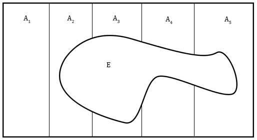

# Probability Basics {#probability-basics}

## Equally Likely Events ## {#equiprob}
If we flip a coin it is said that heads and tails have the same probability because the percentage of both heads and tails tend toward $50\%$ as the number of coin flips increases. Think of a **probability** as the percent of time an outcome occurs when many trials are performed. Here are the results of a simulation.

```{r results = "asis", echo = FALSE, label="trials"}
library(knitr)
library(kableExtra)
library(magrittr)
outcomes <- data.frame(trials = c("10", "1,000", "100,000"), percent_heads = c("60%","48.1%","50.005%"))
outcomes %>% kable(col.names = c("Number of Trials", "Percent Heads")) %>% kable_styling(bootstrap_options = "striped", full_width = FALSE)
```

When we make a "random selection" it means that every possible selection has equal probability. For example, a randomly selected card from a deck of $52$ cards has probability $\frac{1}{52}$ of being a 2 of clubs.

When every possible outcome has equal probability, the formula for the probability of some subset of the outcomes is:

$$\frac{\text{Number of Selected Outcomes}}{\text{Number of Total Possible Outcomes}}$$

What is the probability of drawing 4 aces when we randomly select 5 cards from a deck? The number of ways to draw 4 aces is ${4 \choose 4} = 1$ because there are 4 aces and we must select all of them. There are 48 cards to select that are not aces which leads to ${48 \choose 1} = 48$ outcomes. 

The number of ways to draw 4 aces is:
$${4 \choose 4}{48 \choose 1} = 48$$

The number of ways to draw 5 cards is:
$${52 \choose 5}$$

The answer is then:
$$\frac{{4 \choose 4}{48 \choose 1}}{{52 \choose 5}} = \frac{48}{2598960} = \frac{1}{54145}$$

## Terminology

### Sample Spaces and Events

In probability we talk about experiments, sample spaces, and events. 

When we flip a coin or roll a die that is an **experiment**. Experiments have a set of possible outcomes that happen with some probability.

The set of all possible outcomes of an experiment is the **sample space**. When we flip a coin once the sample space is $S=\{H,T\}$. When we flip a coin twice the sample space is $S=\{HH,HT,TH,TT\}$.

**Events** represent a set of possible outcomes from an experiment. When we flip two coins there is an event for flipping two heads, $E_\text{both heads}=\{HH\}$. There is also an event for not flipping two heads $E_\text{not both heads}=\{HT,TH,TT\}$. An event is a subset of the sample space. It may represent a single outcome of our experiment, or it may represent several of the possible outcomes:
$$E \subseteq S$$

We can rewrite our formula for probabilities when all outcomes of an experiment are equally likely using $n(E)$ for the number of selected outcomes.
$$\frac{\text{Number of Selected Outcomes}}{\text{Number of Total Possible Outcomes}} = \frac{n(E)}{n(S)}$$

***

**Example: Rolling Dice**

We roll two dice and want to calculate the probability that the dice sum to 4. Define the experiment, sample space, event, and calculate the probability of the event.

The experiment is rolling two dice. 

The sample space has 36 elements, we can define it in set-builder notation:
$$\{(a,b)|a,b \in \{1,2,3,4,5,6\}\}$$
The event contains the elements of the sample space summing to 4. 
$$E = \{(1,3),(3,1),(2,2)\}$$
The probability is 
$$\frac{\text{Number of Selected Outcomes}}{\text{Number of Total Possible Outcomes}} = \frac{n(E)}{n(S)} = \frac{3}{36}=\frac{1}{12}$$

***

## Probability Functions

There is a function called a probability function, denoted $P$, that calculates the probability of an event. When we flip a coin twice the probability of getting a head and a tail is:
$$P(\{HT, TH\})=.5$$
For experiments where all outcomes are equally likely:
$$P(E) = \frac{n(E)}{n(S)}$$
A probability is between $0$ and $1$ because an event can't happen less than $0\%$ of the time or more than $100\%$ of the time. More formally, $P$ is a function that takes an event as input and gives a number between $0$ and $1$ as output. In notation:
$$P:E \mapsto [0,1]$$

If we are being more mathematically rigorous, this rule about probabilities being between $0$ and $1$ is derived from some more basic assumptions and not intuition about the percentage of times something occurs. Let's talk about these basic assumptions.

### Probability Axioms ### {#axiomsprob}
There are three fundamental assumptions (called axioms) about probability functions from which our other laws are derived.

**First Axiom** - For an event $E$, and probability function $P$:
$$P(E) \geq 0$$
**Second Axiom** - For a sample space $S$:
$$P(S)=1$$
**Third Axiom** - If $E1, E2, ...En$ are **mutually exclusive** events:
$$P(\bigcup\limits_{i=1}^{\infty} E_{i})=P(E_1 \cup E_2 \cup...\cup En \cup...) = P(E1)+P(E2)+...+P(En)+...$$
For **two mutually exclusive** events events the third axiom is: 
$$P(E_1 \cup E_2) = P(E_1)+P(E_2)$$
  
There are several formulas that are useful for this exam that can be derived from these axioms. We can derive the formula for the probability of the complement of an event:
$$P(A)+P(A^C) = P(A \cup A^C) = \ P(S) = 1 \ using \ Axioms \ 2 \ and \ 3$$
Since $P(A^C)+P(A) = 1 \implies P(A^C) = 1-P(A)$.

Here are some useful formulas that can be derived from these axioms.
$$Complements: \ P(A^C) = 1 - P(A) \\
Upper \ Bound:P(A) \leq 1 \\
General \ Probability \ of \ 2 \ Unions: P(A \cup B) = P(A) + P(B) - P(A \cap B) \\
3 \ Unions: P(A \cup B \cup C) =  \\ P(A) + P(B) + P(C) - P(A \cap B)-P(B \cap C)-P(C \cap A) + P(A \cap B \cap C)$$

Notice that these formulas are the same as our formulas for the size of the set if we swap out $P$ for $n$ and $1$ for $n(S)$.

***

**Example: Coin Flipping and Axioms**

If we flip a coin, heads and tails are mutually exclusive events. 
$$P(\{H\} \cup \{T\}) = P(\{H\})+P(\{T\}) = .5 + .5 = 1$$ 
We know that $P(\{H\}), P(\{T\})=.5$ from our formula for equally likely events at the beginning of the chapter. Note that $S = \{H\} \cup \{T\}$ so this example also illustrates that $P(S)=1$.

***

## Conditional Probability and Independence

```{r, results = "asis", echo = FALSE}
outcomes <- data.frame(pets = c("21", "35", "56"), not_pets = c("18","26","44"), total = c("39", "61", "100"))
row.names(outcomes) <- c("Cats", "Dogs", "Total")
outcomes %>% kable(col.names = c("Fluffy", "Not Fluffy", "Total"),
                   row.names = TRUE) %>% kable_styling(bootstrap_options = "striped", full_width = FALSE) %>% column_spec(1, bold=TRUE, border_right=TRUE) %>% column_spec(4, bold=TRUE) %>% row_spec(3, bold = TRUE)
```

We make estimates about the overall population of pets using the results of a survey about pets. To do this we pretend that the pets in the survey represent the entire population of pets. 

We can calculate the probability of a pet being fluffy using our formula for [equally likely events](#equiprob):
$$\frac{\text{Number of Fluffy Pets}}{\text{Total Number of Pets}} = \frac{n(\text{Fluffy})}{n(\text{Pets})} = \frac{56}{100}$$

We can calculate the probability of a pet being a fluffy cat as:
$$\frac{\text{Number of Fluffy Cats}}{\text{Total Number of Pets}} = \frac{n(\text{Fluffy} \cap \text{Cat})}{n(\text{Pets})} = \frac{21}{100}$$

We can also calculate the probability of a pet being fluffy, given that the pet is a cat:
$$\frac{\text{Number of Fluffy Cats}}{\text{Total Number of Cats}} = \frac{n(\text{Fluffy} \cap \text{Cat})}{n(\text{Cats})}=\frac{21}{39}$$
Calculating the probability of a pet being fluffy given that the pet is a cat is an example of conditional probability because in the denominator we do not include all of the possible pets, but only the cats. There is a special notation for conditional probabilities:
$$\text{Probability Pet is Fluffy given that Pet is a Cat} = P(\text{Pet is Fluffy}|\text{Pet is a Cat})$$
The general formula for conditional probabilities uses probabilities instead of set sizes. If all outcomes are equally likely either the probability or set size formula will give the same result:
$$\frac{P(\text{Fluffy} \cap \text{Cat})}{P(\text{Cat})} =  
\frac{n(\text{Fluffy and Cat})/n(\text{Pets})}{n(\text{Cat})/n(\text{Pets})} = \frac{n(\text{Fluffy}\cap\text{Cat})}{n(\text{Cat})}$$

***

### Conditional Probability Formulas ### {#condprob}
The probability of event $A$ given that event $B$ has occurred is denoted $P(A|B)$ and pronounced "the probability of A given B". 
The general formula for this is $$P(A|B)=\frac{P(A \cap B)}{P(B)}$$

For experiments where all outcomes have equal probabilities $P(A|B)$ can be calculated with set sizes. The derivation for forumla this was done in our example with fluffy cats. $$P(A|B)=\frac{n(A \cap B)}{n(B)}$$

We can calculate the probability of the intersection using the probability of the given event with the conditional probability. This formula is easiest to conceptualize if you imagine an event B happening with probability $P(B)$ and then an event $A$ happening with probability $P(A|B)$. $$P(A|B) \times P(B) = P(A \cap B)$$

***

### Independence

Events are independent if they do not influence each other. The first flip of a coin will not impact the second flip so these events are independent.

Let the event that the first card pulled without replacement from a deck is a jack be $J_1$ and the event that the second card pulled is a jack is $J_2$. If I pull a jack on my first try there will be less jacks in the deck for the second draw. The event $J_1$ has an effect on $J_2$ and these events are not independent.

**Definition of Independence**: Events $A$ and $B$ are said to be independent if $P(A|B)=P(A)$.

This definition is equivalent to $P(A \cap B) = P(A) \times P(B)$ after substitution with the [conditional probability formulas](#condprob). This identity has it's own name:

**Multiplication Rule for Independent Events**: If $A$ and $B$ are independent events then $P(A \cap B) = P(A) \times P(B)$.

Let $H_n$ be the event that the nth flip of a coin is heads so that $H_2$ means the second coin flip is heads. The multiplication rule for independent events works for more than two events if all events are mutually independent so that $P(H_1 \cap H_2 \cap H_3 \cap H_4)=P(H_1)\times P(H_2)\times P(H_3)\times P(H_4) = (\frac{1}{2})^4$.

## Bayes Theorem

### Bayes Theorem Intuition

Suppose 1% of the population uses drugs. 98% of drug users test positive on a drug test and 2% of non-users test positive. What is the probability that a person testing positive for a drug test has used drugs? 


Using the above tree diagram and the definition of conditional probability we calculate: $$P(User|Positive) = \frac{P(User \cap Positive)}{P(Positive)}= \\ 
\frac{P(User \cap Positive)}{P(Positive \cap Not \ User) + (Positive \cap User)} =\\  \frac{P(Positive|User) \times P(User)}{P(Positive|User) \times P(User)+P(Positive|Not \ User) \times P(Not \ User)} = \\
\frac{.0099}{.0099+.0099}=\frac{1}{2}$$

Let's explain these steps in more detail.

### Law of Total Probability
In our calculation when we go from the first to the second line we use the identity $P(Positive)=P(Positive \cap User)+P(Positive \cap Not \ User)$, but how do we know this is true?
$Positive \cap User$ only contains drug users and $Positive \cap Not \ User$ only contains non-users. These events are mutually exclusive so $P(Positive \cap User)+P(Positive \cap Not \ User) = P((Positive \cap User) \cup (Positive \cap Not \ User))$ using our [third probability axiom](#axiomsprob). Using the distributive property for intersections with the identities
$$A^C \cup A = Sample \ Space, \quad A \cap (Sample \ Space) = A$$ 
we can see that:
$$(Positive \cap User) \cup (Positive \cap Not \ User) = Positive \cap (User \cup Not \ User) = \\ Positive \cap (Sample \ Space) = Positive$$
This is how we know that $P(Positive)=P(Positive \cap User)+P(Positive \cap Not \ User)$.

There is a more general formulation of this known as the **law of total probability**:

***

Events $A_1,A_2,...,A_n$ are said to be a **partition** of the sample space $S$ if $A_1 \cup A_2 \cup... \cup A_n=S$ and if for all $i,j: \ A_i \cap A_j = \emptyset$. This just means that the sets $A_1,A_2,...,A_n$ cover the whole set and there is no overlap between the sets.

If sets $A_1,A_2,...,A_n$ partition $S$ then for any event $E$ we have **the law of total probability**:
$$P(E) = P(E \cap (A_1 \cup A_2 \cup ... \cup A_n)) = \\ P(E \cap A_1) + P(E \cap A_2) + ... + P(E \cap A_n) = \\ P(E|A_1) \times P(A_1) +...+ P(E|A_n) \times P(A_n)$$

Here is a visual explaining the intuition behind the equality in the first line of the equations above:



The proof of the law of total probability is outlined in our discussion of drug users.

***

### Bayes Theorem Formula

#### Derivation Using Law of Total Probability

In our previous example every person is either a drug user or not so this partitions the sample space into two regions, $User$ and $Not \ User$. We can use the definition of conditional probability to say:
$$P(User|Positive)=\frac{P(User \cap Positive)}{P(Positive)}$$
We use the law of total probability in the denominator to expand it and convert all expressions of the form $P(A \cap B)$ to expressions of the form $P(B | A) \times P(A)$. The result is:
$$\frac{P(Positive|User) \times P(User)}{P(Positive|User) \times P(User)+P(Positive|Not \ User) \times P(Not \ User)}$$

#### Bayes Theorem Statement

For a partition $A_1,A_2,...,A_n$ and event $E$:
$$P(E|A_k) = \frac{P(E|A_k) \times P(A_k)}{P(E|A_1) \times P(A_1) +...+ P(E|A_n) \times P(A_n)}$$

