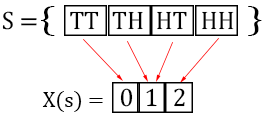
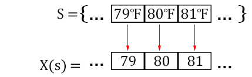
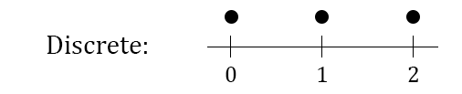
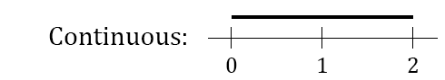
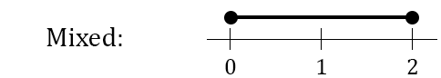

# Random Variables {#random-variables}

## What is a Random Variable

**A random variable is a number determined by chance**. What is the temperature in my city tomorrow? This is a number determined by chance, a random variable. OK sorry. I lied about a random variable being a number. Actually, **a random variable is a function** that takes an element of the sample space as input and produces a real number. What does that mean?

***
```{example, counthead, name="Counting Heads"}
If you flip a coin twice the sample space is $S=\{HH,HT,TH,TT\}$. We define a random variable $X$ that maps the sequence of heads and tails to the number of heads. For example, $X(HT)=1$ because there is exactly 1 head. See below that a random variable is a function that takes elements of the sample space and outputs a number.
  

```
***

Let's return to the question of tomorrow's temperature. I said this is a random variable because it is a random number. But I thought random variables were functions, not numbers? Why did I lie to you?

***
```{example, temperatures, name="Tomorrow's Temperature"}
The set of possible temperatures measured in degrees farenheit is the sample space $S$. Our random variable is a function that sends a temperature in degrees farenheit to the real number that represents the temperature. Notice that there are no units for $X(s)$, it is a real number.
  


See that a random variable is a function. It is just a very simple one.
```
***

Students can get confused about random variables because often the random variable is something simple like in the temperature example. The student then begins to overgeneralize and confuse random variables with sample spaces.

The important part of random variables isn't being able to describe them as being a function. The important part is being able to calculate the probability that tomorrow is a warm day. Let's get into that.

## Probability Distribution Functions

### Probability of an Outcome

We can calculate the probability of a random variable being a particular value. Let's work an example.

***
```{example, name="Probability of One Head"}
Again we are flipping a coin twice and $S=\{HH,HT,TH,TT\}$. Let $s \in S$, and $X$ is the random variable for the number of heads. $X(s) = 1$ when $s \in \{HT,TH\}$. To calculate the probability of $X(s) = 1$:
$$P(X(s)=1)=P(\{HT,TH\})=\frac{1}{2}$$
```
***

Even though $X$ is a function we usually don't write it as such. Instead of saying $X(s)=1$ we usually just write $X=1$ and it is understood that $X$ is a function. In our previous example we could rewrite it as $P(X=1)=P(\{HT,TH\})=\frac{1}{2}$.

### Probability Mass Function Definition

It is common to calculate the probability of a random variable being a value $x$, $P(X=x)$. It is so common that we call it a "probability mass function" (abbreviated **PMF**) and give it special notation.

***
```{definition, name="Probability Mass Function"}
The probability mass function calculates $P(X=x)$. There is a special way to write this, instead of using a capital $P$ we use a lowercase $p$ and say that:
$$p(x)=P(X = x)$$
  
Some properties of the probability mass function are that the probability of an outcome is between 0 and 1, and that the sum of the probability of all possible outcomes is 1:

For $x \in S$
  
* $0 \leq p(x) \leq 1$
* $\sum p(x)=1$

```
***

The table below shows the probabilities from our coin flipping example \@ref(exm:counthead). The probabilities are between $0$ and $1$ and sum up to $1$ as expected.

```{r, results = "asis", echo = FALSE}
library(knitr)
library(kableExtra)
library(magrittr)

outcomes <- data.frame(c1 = c("0", ".25"), c2 = c("1",".5"), c3 = c("2", ".25"))
row.names(outcomes) <- c("x", "p(x)")
outcomes %>% kable(col.names = NULL,
                   row.names = TRUE) %>% kable_styling(bootstrap_options = "striped", full_width = FALSE) %>% column_spec(1, bold=TRUE, border_right=TRUE)
```

## Cumulative Distribution Functions ## {#cdf}

Again we are flipping the coin twice and counting the heads. We can calculate the probability of $0$ heads as $.25$, and the probability of $1$ head as $.5$.

Now we can also calculate $P(X \leq 1) = p(0)+p(1) = .25+.5=.75$. Calculations of this sort are very common, we call it the cumulative distribution function (abbreviated **CDF**). There is a special notation for this.

***
```{definition, name="Cumulative Distribution Function"}
The cumulative distribution function calculates $P(X \leq x)$. There is a special way to write this:
$$F(x)=P(X \leq x)$$
  
We can calculate the cumulative distribution function by summing the probability mass function:
$$F(x_0) = \displaystyle\sum_{x \leq x_0} p(x)$$
```
***

We calculate the cumulative distribution function for our coin flipping example, see that the CDF is the cumulative sum of the PDF.

```{r, results = "asis", echo = FALSE}
outcomes <- data.frame(c1 = c("0", ".25", ".25"), c2 = c("1",".5", ".75"), c3 = c("2", ".25", "1.00"))
row.names(outcomes) <- c("x", "p(x)", "F(x)")
outcomes %>% kable(col.names = NULL,
                   row.names = TRUE) %>% kable_styling(bootstrap_options = "striped", full_width = FALSE) %>% column_spec(1, bold=TRUE, border_right=TRUE)  %>% row_spec(3, underline = TRUE)
```


In the above table we only define the CDF at points $0,1,2$ but we can also calculate the CDF at $.5$. $$F(.5)=P(X \leq .5) = \displaystyle\sum_{x \leq .5} p(x) = p(0) = .25$$
The CDF only changes at values where there are outcomes that happen with some probability. Understand why the graph below looks the way it does.


```{r, eval=FALSE, include=FALSE}
pdf = data.frame(values=c(0,1,1,2))
full_points = data.frame(xval = c(0,1,2), yval = c(.25,.75,1))
empty_points = data.frame(xval = c(0,1,2), yval = c(0,.25,.75))

ggplot(pdf, aes(x=values)) + 
  stat_ecdf(geom="step") + 
  geom_point(data=full_points, aes(x=xval, y=yval), size = 5) +
  geom_point(data=empty_points, aes(x=xval, y=yval), size = 5, 
             shape=21, fill = "white", colour="black", stroke = 1) +
  scale_x_continuous(breaks=c(0,1,2)) + 
  xlab("Number of Heads") + ylab("F(X)") + ggtitle("Graph of CDF") +
  theme_minimal()
```

## Discrete vs. Continuous Random Variables

So far we have only talked about flipping coins. When I flip a coin twice the only possible numbers for the heads are $\{0,1,2\}$. This is an example of a **discrete random variable**. Discrete means that only certain numbers are possible. Plotting the possible outcomes on a number line yields a series of points. 



Some random variables are **continuous**. This means that the outcomes are intervals instead of points. The height of a person is continuous, they could be 5.983732... feet tall. Any number is possible.




Some random variables are continuous and discrete **mixed** together. If my speakers volume knob must be between $0$ and $2$ then often my speakers will often be turned to exactly $0$ (no sound) or $2$ (max sound). If the volume knob is somewhere between $0$ and $2$ it could be turned to any number, like 1.5543..., so the volume knob is a mixture of discrete and continuous.



### A Bit More Precise
In the volume knob example the possible outcomes come from the interval $[0,2]$, this sounds continuous? What about it exactly is mixed? In the CDF there is a jump at $0$ because $P(X \leq -.01)=0$ but $P(X \leq 0) =$ the probability that the volume is zero.


```{r, eval=FALSE, include=FALSE}
mixed = data.frame(xval=c(-.2,0,.00001,2,2.00001,2.2),
                   yval=c(0,0,.25,.75,1,1))
full_points = data.frame(xval=c(0,2), yval=c(.25,1))
empty_points = data.frame(xval=c(0,2), yval=c(0,.75))

ggplot(data = mixed, aes(x=xval,y=yval)) + geom_line() +
  geom_point(data=full_points, aes(x=xval, y=yval), size = 5) +
  geom_point(data=empty_points, aes(x=xval, y=yval), size = 5, 
             shape=21, fill = "white", colour="black", stroke = 1) +
  scale_x_continuous(breaks=c(0,1,2)) + 
  xlab("Volume Knob Position") + ylab("F(X)") + ggtitle("Continuous/Discrete Mixed Distribution") +
  theme_minimal()
```

Generally discrete distributions are just going to bounce around without ever smoothly increasing over an interval. Consider the coin flipping CDF graph at the end of last section. Continuous distributions smoothly increase over intervals. Let our random variable be a randomly draw a number in $[0,1]$. The CDF smoothly increases from $0$ to $1$ on $[0,1]$.

```{r, eval=FALSE, include=FALSE}
continuous = data.frame(xval=c(-.1,0,1,1.1),
                   yval=c(0,0,1,1))
ggplot(data = continuous, aes(x=xval,y=yval)) + geom_line() +
  scale_x_continuous(breaks=c(0,1)) + 
  xlab("Interval [0,1]") + ylab("F(X)") + ggtitle("Continuous Distribution") +
  theme_minimal()
```
The CDF jumps at a point $x$ when $P(X=x)$ is nonzero, consider our volume knob example for evidence of this. A randomly selected number from $[0,1]$ is **exactly** $.5$ with probability $0$, so the continuous random variable has no jumps. There are infinitely many numbers in $[0,1]$ and $.5$ is only one of these infinitely many numbers. From our formula for equally likely outcomes:
$$\frac{\text{Number of Selected Outcomes}}{\text{Number of Total Outcomes}}=\frac{1}{\infty}=0$$

We are still not telling the whole story. Continuous distributions end up using a bunch of calculus and we will discuss them in a later chapter.
