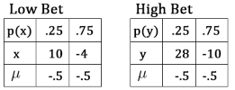
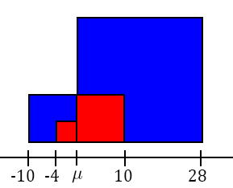

# Functions of Discrete Random Variables

## What is the Mean?
Your friend plays a game with you where he flips a coin twice. You win $10\$$ if both flips are heads, and lose $4\$$ otherwise. Let's simulate some results to see if we should play this game.
```{r, eval=FALSE, include=FALSE}
library(tidyverse)
set.seed(2)
coinflips <- data.frame(random = runif(10000)) %>%
  mutate(payout = case_when(
    random <= .25 ~ 10,
    TRUE ~ -4),
    `Money Earned` = cumsum(payout),
    `Games Played` = row_number())

library(gridExtra)
p1 <- coinflips %>% filter(`Games Played`<=50) %>%
  ggplot(aes(x = `Games Played`, y = `Money Earned`)) + geom_line() + theme_bw()

p2 <- coinflips %>%
  ggplot(aes(x = `Games Played`, y = `Money Earned`)) + geom_line() + theme_bw()

grid.arrange(p1,p2,ncol=2)
```


After $50$ games we might think this is a fun game but in fact the odds are stacked against us. On average we lose .5 dollars per game. In our simulation notice that the average payoff approaches $-.5$.

```{r, eval=FALSE, include=FALSE}
coinflips %>% filter(`Games Played` >= 100) %>%
  select(`Games Played`, `Money Earned`) %>% 
  mutate(`Average Payout` = `Money Earned`/`Games Played`) %>%
  ggplot(aes(x = `Games Played`, y = `Average Payout`)) + geom_line() + theme_minimal() + 
  scale_y_continuous(breaks = seq(-.5,.2,.1)) + scale_x_continuous(breaks = c(100,2500,5000,7500,10000))+
  ylab("(Total Payoff)/(Games Played)") +
  ggtitle("Average Payoff Per Game")
```


We can calculate the average payoff over the $10,000$ simulated games by adding up the payoffs and dividing by the number of games:

```{r, results = "asis", echo=FALSE, message=FALSE, warning=FALSE}
library(tidyverse)
library(knitr)
library(kableExtra)
outcomes <- data.frame(`Games Played` = "10000", Wins = "2501", Losses = "7499")
outcomes %>% 
  kable(col.names = c("Games Played", "Wins", "Losses")) %>% 
  kable_styling(bootstrap_options = "striped", full_width = FALSE) %>% 
  column_spec(1, bold=TRUE, border_right=TRUE)
```

$$\frac{\sum \text{Payoff} }{\text{Number of Games}} = \frac{2501 \times 10 + 7499 \times {-4}}{10000}=-0.4986$$
We can do some rearranging:
$$\frac{2501 \times 10 + 7499 \times{-4}}{10000} = \frac{2501}{10000}(10)+\frac{7499}{10000}({-4}) = \\ \%  \text{Wins} \times 10 + \% \text{Losses} \times {-4}$$

As the number of trials increases $\% \text{Wins}$ approaches $P(\{HH\})$ and $\% \text{Losses}$ approaches $P(\{HT,TH,TT\})$. We can define a random variable $X$ to represent the payoff with a probability distribution function of:
$$p(10) = P(\{HH\}) = .25 \\ p(-4) = P(\{HT,TH,TT\})=.75$$
We can then write the long term average payoff as:
$${-4} \times p({-4})+10 \times p(10) = .75 \times {-4} + .25 \times 10=-.5$$
So the long term payoff of our random variable is $.5$. When we have a random variable $X$ that represents the payoff, we say that this is the **mean** of $X$.

***
```{definition, expectedvalue, name="Expected Value"}
The mean of a random variable $X$ is also called the **expected value** and is denoted by $E(X)$ or $\mu$. To calculate the value of the mean we take the probability weighted sum of the possible values of the random variable.

$$ \mu = E(X) = \sum p(x) \times x$$

```
***

Take a moment and see that the summation in our calculation is the same one performed in our calculation of the coin flipping game. 

***
```{example, name="Average Heads"}
We flip a coin twice, let $X$ be the number of heads. What is $E(X)$?
  
$$E(X) = p(0) \cdot 0 + p(1) \cdot 1 + p(2) \cdot 2 = .25 \cdot 0 + .5 \cdot 1 + .25 \cdot 2 = 1$$
```
***

### E(aX + b)
Suppose we flip a coin twice. We play a game where we receive $2\$$ for every head we flip. Let the random variable for the number of dollars we receive be $Y$ and the random variable for the number of heads flipped be $X$. Notice that $Y=2X$.

```{r, results = "asis", echo = FALSE}
outcomes <- data.frame(c1 = c(".25","0","0"), c2 = c(".5","1","2"), c3 = c(".25","2","4"))
row.names(outcomes) <- c("Probability", "Heads", "Dollars")
outcomes %>% kable(col.names = NULL, row.names = TRUE) %>% 
  kable_styling(bootstrap_options = "striped", full_width = FALSE) %>% 
  column_spec(1, bold=TRUE, border_right=TRUE)
```

We calculate $E(Y)$:
$$E(Y) = .25 \cdot 0 + .5 \cdot 2 + .25 \cdot 4 = 2$$
$E(Y) = 2$ and from example \@ref(exm:counthead), $E(X) = 1$. This makes sense because $Y = X-1$. What if we got $4$ dollars or $7$ dollars for each head? In general if we get $a$ dollars per head:

\begin{align}
E(Y) &= .25 \cdot 0 + .5 \cdot a + .25 \cdot 2a \notag \\
&= a(.25 \cdot 0 + .5 \cdot 1 + .25 \cdot 2) \notag \\
&= aE(X) \notag
\end{align}

Let's make a new game. We still get $2$ dollars for each head but this time we have to pay $1$ dollar to play. Let the random variable representing the payout be $Z$. Note that $Z=Y-1$. We calculate $E(Z)$:

$$E(Z) = .25 \cdot {-1} + .5 \cdot 1 + .25 \cdot 3=1$$
Notice that $E(Z) = E(Y) - 1$ which makes sense since $Z = Y - 1$. What if we have to pay a different amount? Let's come up with a formula for $Z$ = $Y-a$

\begin{align} 
E(Z) &= .25 \cdot (0-a) + .5 \cdot (2-a) + .25 \cdot (4-a) \notag \\
&= (.25 \cdot 0 + .5 \cdot 2 + .25 \cdot 4) + a(.25+.5+.25) \notag \\
&= E(Y) - a = 2E(X)-a \notag
\end{align}

These tricks work for any random variable, not just coins. The proof of the following theorem is very similar to the calculations we have been doing.

***
```{theorem, name="E(aX+b)"}
For a random variable $X$ with constants $a$ and $b$:
$$E(aX+b) = aE(X)+b$$
```
***

## What is Variance?

At the beginning of the chapter we played a game where we flip a coin twice. We win $10\$$ if both flips are heads and lose $4\$$ otherwise. Let's increase the bet size. In our new bet we win $28\$$ if both flips are heads and lose $10\$$ otherwise. Experimentally we can see that both of the bets have the same long term average loss of $-.5$.


We verify this using the formula for expected values (\@ref(def:expectedvalue)):
$$.25 \cdot 28+.75 \cdot {-10}=-.5$$

A difference between the lower and the higher bet sizes is that with the higher bet is that there are bigger wins and bigger losses. Notice in the graph below how the increases and decreases in money earned are larger with the higher bet size. In this example the higher bet size has the same mean but a higher **variance**
```{r, eval=FALSE, include=FALSE}
set.seed(3)
coinflips <- data.frame(random = runif(10000)) %>%
  mutate(low_payout = case_when(
    random <= .25 ~ 10,
    TRUE ~ -4),
    high_payout = case_when(
      random <= .25 ~ 28,
      TRUE ~ -10),
    `Money Earned Low Bet` = cumsum(low_payout),
    `Money Earned High Bet` = cumsum(high_payout),
    `Games Played` = row_number())

coinflips %>% filter(`Games Played` <=1000) %>%
  ggplot() + 
  geom_line(aes(x = `Games Played`, y = `Money Earned Low Bet`, color = "red")) + 
  geom_line(aes(x = `Games Played`, y = `Money Earned High Bet`, color = "darkblue")) + 
  scale_color_discrete(name = "Bet Size", labels = c("High", "Low")) +
  theme_minimal() +
  ylab("Money Earned") + 
  ggtitle("Results of a Coin Flipping Game", subtitle = "Comparing High vs. Low Bets")
```


### Defining Variance
***
```{definition, variance, name="Definition of Variance"}
The variance of a random variable $X$ is denoted by $V(X)$. It is defined as:
$$V(X)=E((X-\mu )^2) = \sum (x - \mu)^2 \cdot p(x)$$
```
***

Let $X$ be the payoff of the smaller bet sizes and $Y$ be the payoff for the larger bet sizes. We calculate the variance of the payoff for both games.



$$V(X) = E((X-\mu)^2) = .25 \cdot (10 - ({-.5}))^2 + .75 \cdot ({-4} - (-.5))^2 = 36.75$$
$$V(Y) = E((Y-\mu)^2) = .25 \cdot (28 - ({-.5}))^2 + .75 \cdot ({-10} - (-.5))^2 = 270.75$$

The game with the larger bet sizes has a larger variance, agreeing with our experiments

***
```{exercise}
Let $X$ be $1$ if a coin flips heads and $0$ if it is tails. Show that the $V(X) = .25$. 
```
***

### Variance Intuition
Consider that $V(X)=\sum (x - \mu)^2 \cdot p(x)$. $(x - \mu)^2$ is the area of a square with sides of length $x - \mu$. $V(X)=\sum (x - \mu)^2 \cdot p(x)$ is then the probability weighted sum of the area of squares. Do you see why the larger bet sizes cause a larger variance?



### V(aX+b)
Suppose we flip a coin once. We receive $2\$$ if the coin is heads. Let $X$ be $1$ if heads and $0$ otherwise, and $Y$ be the number of doillars received. Note that $Y=2X$. $E(Y)=1$ and $E(X)=.5$, remember that these numbers appear in our variance formula as $\mu$. We calculate $V(X)$ and $V(Y)$:
$$V(X) = .5 \cdot (0-.5)^2 + .5 \cdot (1-.5)^2=.25$$
$$V(Y) = .5 \cdot (0-1)^2 + .5 \cdot (2-1)^2=1$$

There is a good reason that $V(Y) = V(2X)= 2^2\cdot V(X)$

\begin{align} 
V(Y) &= .5 \cdot (0-1)^2 + .5 \cdot (2-1)^2 \notag \\
&= .5 \cdot (2 \cdot 0- 2 \cdot .5)^2 + .5 \cdot (2 \cdot 1-2 \cdot .5)^2 \notag \\
&= 2^2 \cdot (.5 \cdot (0-.5)^2 + .5 \cdot (1-.5)^2) \notag \\
&= 2^2 \cdot V(X)
\end{align}

In general it is true that $V(aX) = a^2 V(X)$. The manipulations performed in the coin flipping example could be applied anywhere.

What if we make a new random variable $Z$ where we make $2\$$ for heads and $1\$$ dollars for tails? In this case $Z = X+1$. We calculate $V(Z)$, note that $E(Z)=E(X+1)=E(X)+1=1.5$:
$$V(Z) = .5 \cdot (1-1.5)^2 + .5 \cdot (2-1.5)^2=.25$$
$V(Z)=V(X)$ because the values are spread out the same distance. In general $V(X+b) = V(X)$ because the translation does not change how far apart the values are. If you are feeling inspired try to write a proof of this.

Combining these observations we get the following theorem. 

***
```{theorem, name="V(aX+b)"}
For a random variable $X$ with constants $a$ and $b$:
$$V(aX+b) = a^2 V(X)$$
```
***

***
```{exercise}
Show that $V(-2X+1) = 4V(X)$.
```
***


