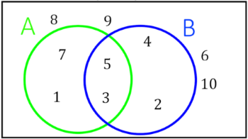
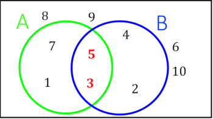
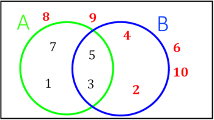
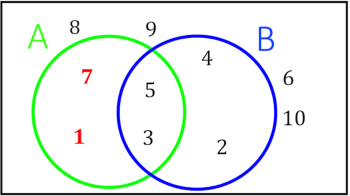
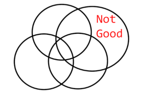

--- 
title: "An Exam P Study Guide"
author: "Actuary Helper"
date: "`r Sys.Date()`"
site: bookdown::bookdown_site
output: bookdown::gitbook
documentclass: book
bibliography: [book.bib, packages.bib]
biblio-style: apalike
link-citations: yes
github-repo: rstudio/bookdown-demo
description: "This is a study guide for exam P."
always_allow_html: TRUE
---

# An Introduction to Set Theory

## Defining Sets

Sets are collections of objects. Usually objects are placed inside curly braces and separated by commas. Here is the set with the numbers 1 and 2. We often give sets a name. This set is named "A". $$A=\{1,2\}$$ 

Objects inside the curly braces are called elements of the set. There is a special character that means "is an element of". Using our notation we can say that 1 is an element of A. $$1 \in A$$

We can also say that 3 is not an element of A by drawing a slash through our symbol. 
$$3 \not\in A$$
We can define sets in a something called set-builder notation. Set builder notation is useful for infinite sets or sets that are hard to enumerate. Below are some examples.

We can define the even numbers as $\{x | x \ is \  an  \  even \ number\}$

We can define hands of cards as $\{x | x \ is \  a \ 5 \ element \ subset \ of \ a \ deck \ of \ cards\}$

To read set builder notation we translate the "|" as "where". So the real numbers are "the set of x where x is a real number".

## Set Equality and Subsets

Sets are equal when they have the same elements. This means order doesn't matter in sets, $\{1,2\} = \{2,1\}$ because they have the same elements. Also, $\{1,1,2\} = \{1,2\}$ and we say that sets don't have duplicate elements because duplicate elements have no purpose. 

A set is a subset of another set when it fits inside of it. There is a symbol that looks like $\leq$ that means "is a subset of". For example $\{1,2\} \subseteq \{1,2,3\}$. It is also true that any set is a subset of itself, so $\{1,2\} \subseteq \{1,2\}$. In more precise terms $A \subseteq B$ if and only if every element of A is also an element of B.

A common technique to prove that two sets are equal is to show that $A \subseteq B$ and $B \subseteq A$. This means there is no element in either set that does not belong to the other and the sets are equal.

## Set Operations and Venn Diagrams

Just like you can add numbers together to make a new number, you can combine sets and make a new set. Let's define some sets.

$$S = \{1,2,3,4,5,6,7,8,9,10\} \\
 A = \{1,3,5,7\} \\
 B = \{2,3,4,5\}$$

### Venn Diagram

There is a visual representation of sets called a Venn Diagram. In a Venn Diagram each set is represented by a circle. The sample space is usually represented by a large box that the circles are inside of.

### Union

An element is in the union of A and B if it is in A, B, or A and B. The notation for this operation is $A \cup B$ and it is pronounced "A union B". Here is the set that results from this union: $A \cup B = \{1,2,3,4,5,7\}$

### Intersection

An element is in the intersection of A and B if it is in A and B. The notation for this operation is $A \cap B$ and it is pronounced "A intersect B". Here is the set that results from this intersection: $A \cap B = \{3,5\}$

### Complement

An element is in the complement of A if it is not in A, but is in the sample space. The notation for the complement of A is $A^C$ and is pronounced "A complement" or "the complement of A". Here is the result of taking the complement of A: $A^C = \{2,4,6,8,9,10\}$. Note that in general $(A^C)^C = A$.

### Set Difference

The set difference of A and B elements that are in A but not in B. The notation is either $A \backslash B$ or $A - B$ and is pronounced "A minus B". Here is the result of this set difference: $A - B = \{7,1\}$. It is worth noting that $A-B=A \cap B^C$ because the elements are in A and they are not in B.

## Special Sets and Identities

### Sample Space and Empty Set

The sample space is a type of special set because all other sets are subset of it. This leads to some commonsensical identities like $A \cup S = S$ and $A \cap S = A$. There is another special set called the empty set. This set has no elements. We could write it as $\{\}$ but the common way to write this is $\emptyset$. Some properties of the empty set are $A \cup \emptyset = A$ and $A \cap \emptyset = \emptyset$. It is also true that $\emptyset^C = S$ and $S^C = \emptyset$.

### De Morgan's Laws

De Morgan's laws are formulas for the complement of a union or intersection of sets.
$$(A \cap B)^C = A^C \cup B^C \\
 (A \cup B)^C = A^C \cap B^C$$
One way of memorizing these formulas is that you bring the complement inside the parentheses to both sets and flip the union or intersection upside down.

Let's see if these laws make any sense. Let $T$ be the set of tennis players and $H$ be the set of hockey players. $(T \cap H)^C$ is the set of people that don't play both tennis and hockey. $T^C \cup H^C$ is people that don't play tennis or they don't play hockey.If I don't play both sports then I either don't play tennis or I don't play hockey, so $(T \cap H)^C \subseteq T^C \cup H^C$. If I don't play tennis or I don't play hockey then it is true that I don't play both sports, so $T^C \cup H^C \subseteq (T \cap H)^C$. This means that the sets are equal, ponder this for some time. A similar argument can be made for the complement of the union. If this is not convincing spend some time with a Venn diagram and see if you can get it to make sense.

### 3 or More Sets

#### Associativity
Just like you can add more than two numbers together you can take the intersection or union of more than two sets. For example $\{1,2\} \cap \{2,3\} \cap \{3,4\} = \emptyset$. There are no elements in the intersection of these three sets because no number appears in all three sets, so this is the empty set. Intersections are associative, meaning $(A \cap B) \cap C= A \cap (B \cap C)$, so it doesn't matter what order you take a group of intersections in. Unions are also associative, $(A \cup B) \cup C= A \cup (B \cup C)$.

#### Distributive Property
If you mix together unions and intersections in an expression it isn't associative. Can you think of an example?
$$A \cap (B \cup C) \not= (A \cap B) \cup C$$ 
There are distributive formulas for situations like this. 
$$A \cap (B \cup C) = (A \cap B) \cup (A \cap C) \\
 A \cup (B \cap C) = (A \cup B) \cap (A \cup C)$$ 
Because of this it is said that intersection distributes over unions, and that unions distribute across intersections. It is easier to remember these distributive formulas by comparing them to the way multiplication distributes over addition. $a(b+c)=ab+ac$. Just pretend that the multiplication is an intersection and the addition is a union.

#### Messy Venn Diagrams
You can draw a Venn diagram for three sets with three circles. It gets a little complicated. I wouldn't bother drawing a Venn diagram for 4 sets.

